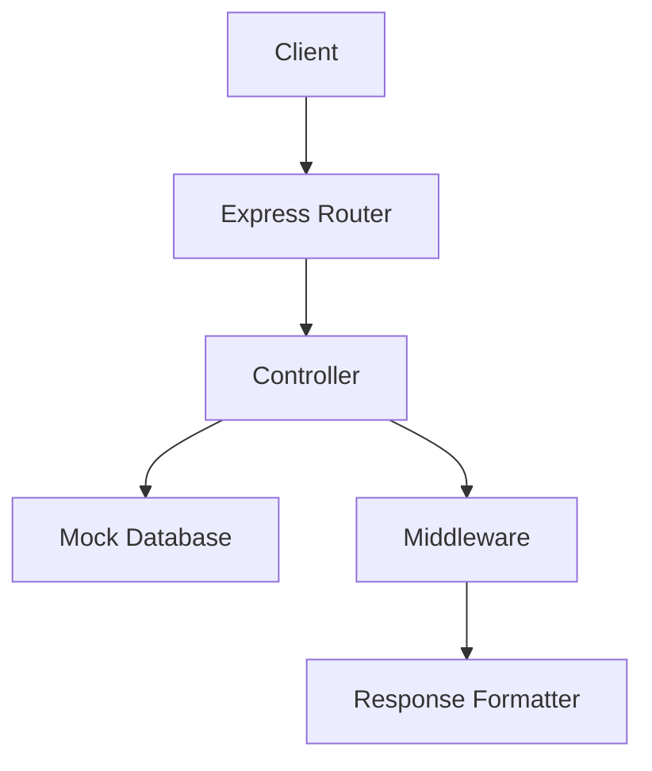

# Practical 1: RESTful API Implementation Reflection

## Documentation

### Core Architecture


### Key Components
1. **Routing System**
   - RESTful endpoint design
   - HTTP method enforcement
   - Parameter validation

2. **Controller Layer**
   - Business logic separation
   - Error handling
   - Data transformation

3. **Middleware**
   - Authentication simulation
   - Content negotiation
   - Response formatting

## Challenges & Solutions

### 1. Content Negotiation
**Problem**: Implementing XML responses was complex  
**Solution**: Created response formatter middleware  
```javascript
// middleware/formatResponse.js
if (acceptHeader.includes('application/xml')) {
  res.set('Content-Type', 'application/xml');
  return res.send(convertToXml(obj));
}
```
### 2. Pagination Implementation
**Issue**: Manual pagination calculations were error-prone  
**Fix**: Developed reusable pagination utility  
```javascript
// controllers/userController.js
const page = parseInt(req.query.page) || 1;
const limit = parseInt(req.query.limit) || 10;
const startIndex = (page - 1) * limit;
```

### 3. Error Handling
**Challenge**: Consistent error responses  
**Implementation**: ErrorResponse class  
```javascript
class ErrorResponse extends Error {
  constructor(message, statusCode) {
    super(message);
    this.statusCode = statusCode;
  }
}
```

## Key Learnings

1. **REST Principles**
   - Proper HTTP method usage
   - Resource-oriented design
   - Status code semantics

2. **API Design**
   - Endpoint naming conventions
   - Versioning considerations
   - Documentation importance

3. **Middleware Power**
   - Cross-cutting concerns
   - Request/Response transformation
   - Pipeline architecture


---
